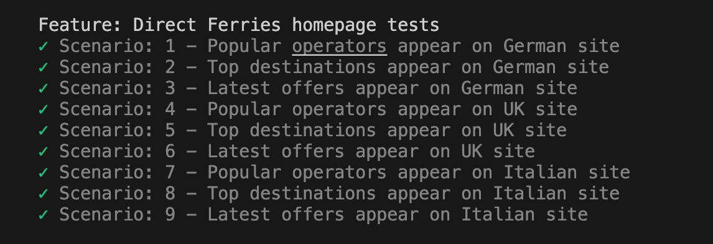
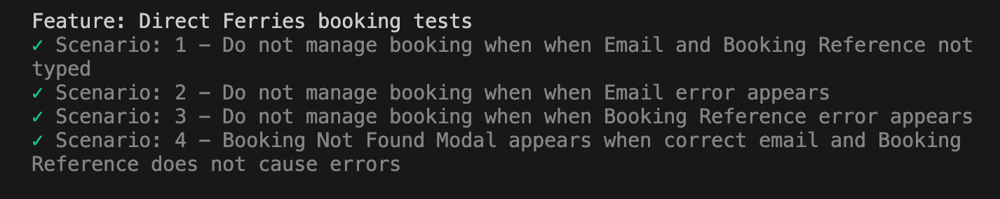
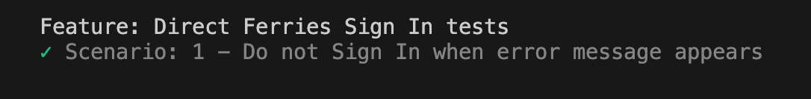
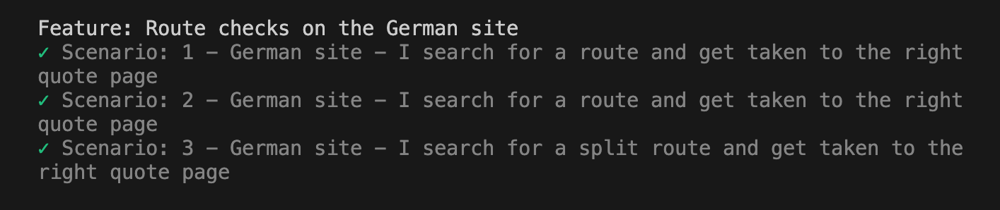

# 💻 Direct Ferries E2E Tests

Automated E2E tests suite developed with Gherkin, Cucumber and TestCafe.

Run the script by using command:

```
npm run test
```

## ✅ Completed Tasks

1. **Extended the test coverage for sites:**   
   - 🇩🇪 [Germany](https://www.directferries.de)  
   - 🇬🇧 [UK](https://www.directferries.co.uk)  
   - 🇮🇹 [Italy](https://www.directferries.it) 

   I have modified the **onHomepage** method:

   ```
     onHomepage: async function (url) {
        await t
            .navigateTo(url)
        
        if (!(url.includes('.uk'))) {
            const acceptButton = Selector('[data-cky-tag="accept-button"]');
            await t.click(acceptButton);
        }
    },
   ```
- The UK homepage does not have a cookie popup, so I added an if statement that checks whether the URL does not include the substring '.uk'. If the site is not UK-based, the code assumes a cookie consent dialog will be present.

   

2. **Validated Booking and Sign In sites:**  
 I have validated two sites instead of one: [Booking](https://account.directferries.com/?culture=en-GB) and [Login (SignIn)](https://account.directferries.com/signin?tab=sign-in).





3. **Fixed failing route-check feature for Scenarios 1 & 3**  
   
   I have rewritten the **selectRoute** method:

   ```
     selectRoute: async function (leg, route) {
        await t
            .typeText(await getRoute(leg), " ") //type a space first as we sometimes have issues where the first type text doesn't register
            .typeText(await getRoute(leg), route)
            .click(await getRoute(leg))

        const formattedRoute = route.replace(' - ', '-'); // "Amalfi - Neapel" -> "Amalfi-Neapel"
        const matchingButton = Selector(`[data-testid="result-section-0"] button[data-testid="${formattedRoute}"]`);
        await t.click(matchingButton)
              .scroll('top')//only needed for tablet sized screens to scroll to top after click.
    },
   ```

🔧 Added dynamic mapping from route → data-testid
→ route.replace(' - ', '-') allows converting "Amalfi - Neapel" to match the button's data-testid="Amalfi-Neapel"

🔍 Instead of clicking the first button, the method now selects the specific matching button:
```
Selector(`[data-testid="result-section-0"] button[data-testid="${formattedRoute}"]`)
```
→ This ensures that exactly the button corresponding to the searched route is selected.

🧠 Works dynamically, because it's based on the route value, not a hardcoded button or index.



# 💡 Given more time, I would:

-  I believe that in the first task, within the homepage-tests.feature file, the string values like 'German', 'Italian', and 'UK' could be handled dynamically, which would reduce the number of scenarios. Based on that, the step definitions could then dynamically pass the appropriate URL. However, for now, I’ve left the task as it is. Although, on the other hand, the current approach is quite readable. It would also be interesting to hear other testers' opinions on this, whether the DRY principle should always be applied, or if in some cases, readability and clarity might take precedence.

- Improve understanding of the structure and asynchronous behavior of the pages, with a particular focus on route logic (task 3). This will likely come through hands-on work, reviewing mapping documents, and collaborating with developers and solution designers/architects.

- Optionally, create a class to keep all selectors organised in one place.